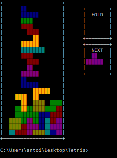

# Python Tetris - 2024


## Description

This project implements a **Tetris Game** with a focus on **OOP** methodology. For more details, please refer to `Projet 2 - INFOF209`.

<p align="center">
  
  <br/>
  <strong>Tetris in Terminal</strong>
</p>

## Usage

Make sure you have `Python >= 3.11` installed.

### Controls

- `<LEFT>, <RIGHT>, <DOWN>` keys to move piece.
- `<C>, <V>` keys to rotate piece.
- `<SPACE>` key to make the piece fall instantly.
- `<B>` to use the hold option.


### Running the Project

1. Clone the repository:

   ```bash
   git clone https://github.com/Ant0in/Python-Tetris.git
   ```

2. Navigate to the project directory:

   ```bash
   cd Python-Tetris
   ```

3. Install dependencies:
   
   ```bash
   pip install -r "requirements.txt"
   ```

4. Run the project:

   ```bash
   python ".\main.py"
   ```

## License

This project is licensed under the **MIT License**. You are free to use, modify, and distribute this software.

## Acknowledgements

This project was developed for the "Projet 2" course `INFO-F209`.

